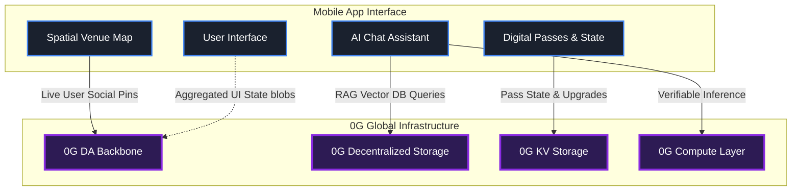
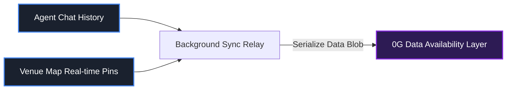

# Effisend0G: 

  
An agentic, high-performance concierge application designed to make massive-scale physical venues (like Tokyo Dome) fully verifiable and autonomous by leveraging the 0G modular infrastructure.

## 🌌 Overview

Effisend0G acts as a decentralized operating system for physical spaces. By integrating AI agents and spatial mapping, attendees can navigate and interact in real-time, while their chat and location data are anchored directly on **0G** infrastructure. 

**The Challenge:** Current Web3 interactions are clunky and expensive at scale. Massive real-world venues (50,000+ attendees) require high-throughput data solutions. Real-time AR pins, social check-ins, and high-frequency AI chat logs generate data payloads too heavy for traditional L1/L2 networks.

**The Solution:** By abstracting all heavy lifting—from AI context vectors to real-time spatial pins—onto 0G's high-throughput infrastructure, Effisend0G delivers Web2-speed experiences with robust Web3 verifiability. It supports an autonomous economy where AI agents can execute trustless actions for users on site.

---

## 🏗️ Architecture & 0G Integration

Our core architecture turns 0G into the native backend of the venue. The mobile application relies entirely on the 0G network for state persistence, massive data availability, and smart agent operations.

### 🧠 Agentic AI with 0G Storage & KV
***Decentralized Vector Knowledge Base & Dynamic State***

We replaced centralized asset reliance with **0G KV and Storage**. 
- **Agentic RAG:** For the concierge AI, 0G Storage acts as our decentralized Vector Knowledge Base. The chat API dynamically pulls "Venue Context Rules" from 0G Storage prior to querying the LLM. This prevents hallucinations without relying on centralized data silos.
- **Dynamic Assets:** Digital passes fetch their dynamic state (e.g., points, active zones) natively from 0G KV nodes for high-speed, verifiable retrieval.

### 🌍 High-Throughput Spatial Rollups via 0G DA
***Verifiable Social Interactivity***

Users generating live social map pins and interacting heavily with AI models produce excess data for standard networks. We utilize a background sync relay to serialize these heavy user interactions (map coordinates and chat history) into immutable blobs that are committed directly to the **0G DA Layer**.

### ⚡ Verifiable Inference via 0G Compute
***Autonomous & Trustless Execution***

To perform high-stakes operations securely (such as an AI agent autonomously upgrading a user's venue access or executing a micro-transaction), `Effisend0G` leverages **0G Compute**. This ensures the LLM inference is trustless and executed in a verifiable environment, enabling autonomous capabilities safely.

---