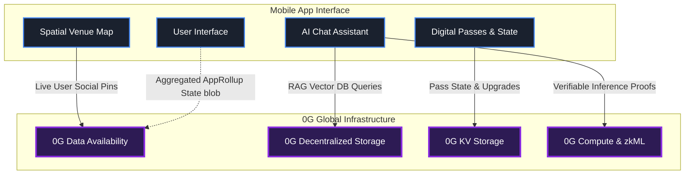
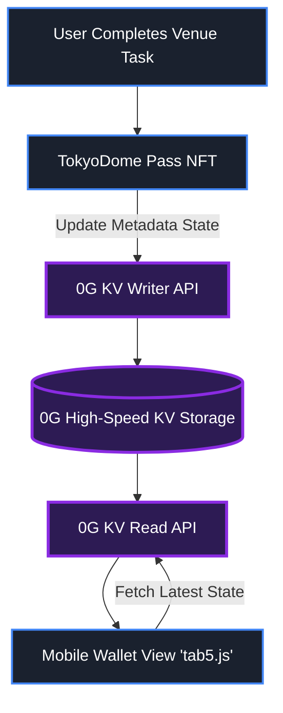
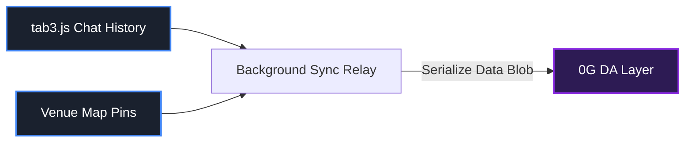
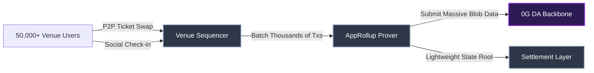

# Effisend-0G: 0G APAC Hackathon

Effisend is a highly optimized concierge application serving as the interface for massive-scale venue interactions. For the Tokyo Dome use-case, visitors interact with a decentralized AI agent for real-time guidance, navigate an interactive social map with live pins, and manage their dynamic digital access passes. By abstracting away traditional, clunky blockchain layers and settling all heavy lifting onto **0G**, we provide a Web2-speed experience with robust Web3 verifiability.

**🔗 Test the Live Application:** [https://effisend-tdc.expo.app/](https://effisend-tdc.expo.app/)

---

## 🏗️ Core Architecture (The 0G Scalability Engine)

Our overarching design turns 0G into the native operating system of the venue. All primary logic, storage, and data availability settle directly onto the 0G network.

---

## 🚀 Implementation Roadmap: Integrating 0G

To ground this ambitious architecture into a realistic execution plan, the 0G modular integration is split into an immediate **Hackathon MVP phase**, followed by a long-term production vision.

### Phase 1: 0G Hackathon MVP (Immediate Deliverables)
These features will be integrated directly into the `EffisendTDC` React Native mobile client and API layers during the hackathon period:

#### 1. Decentralized NFT Pass State (0G Storage / KV)
*Implementation:* Migration of the mobile wallet's `tab5.js` asset fetching. Instead of hardcoded generic IPFS gateways, digital pass metadata is housed natively on 0G Storage/KV nodes, providing a fast, decentralized query layer for Tokyo Dome passes.

#### 2. Decentralized RAG Context for AI (0G Storage)
*Implementation:* Within `chatWithAgent+api.js`, the API intercepts the user prompt and pulls a "Venue Context Payload" (schedules, rules) dynamically from a 0G Storage node before passing it to the LLM. This prevents hallucination by using 0G Storage as a decentralized Vector knowledge base.

```mermaid
sequenceDiagram
    participant User in tab3.js
    participant API as chatWithAgent API
    participant 0G_Storage as 0G Storage (Vector DB)
    participant LLM as AI Engine
    
    User in tab3.js->>API: "Where is the closest bathroom?"
    rect rgb(45, 27, 84)
    API->>0G_Storage: Fetch Spatial Rules & Map Vectors
    0G_Storage-->>API: Venue Context Payload
    end
    API->>LLM: Prompt + 0G Context
    LLM-->>User in tab3.js: "It's in Section 104, guiding you now."
```

#### 3. Chat & Spatial DA Archiving (0G DA)
*Implementation:* A background sync relay that collects heavy user interaction data (the AI chat conversation histories in local storage and spatial MapLibre pins) and commits them as immutable blobs directly to the **0G DA** layer, maintaining infinite record-keeping without expensive EVM gas.

---

### Phase 2: Future Vision (0G V2 Mainnet & Compute)
Once the core DA and Storage MVPs are established, the application will shift its advanced mechanics to 0G's bleeding-edge limits:

#### 1. Trustless AI Execution (0G Compute)
*Implementation:* Offloading the LLM endpoints completely to 0G Compute nodes. By generating inline cryptographic execution proofs (zkML), it guarantees that high-stakes, AI-driven venue operations (e.g., granting VIP access via biometric matching) are statistically verifiable and entirely decentralized.

```mermaid
sequenceDiagram
    participant User
    participant 0G_Compute as 0G Compute (Inference)
    participant 0G_Storage as 0G Storage (Vector DB)
    
    User->>0G_Compute: "Do I have VIP access to Floor 1?"
    rect rgb(45, 27, 84)
    0G_Compute->>0G_Storage: Retrieve Access Rules
    0G_Storage-->>0G_Compute: Venue Context
    0G_Compute->>0G_Compute: Run Model Inference + Generate zkML Proof
    end
    0G_Compute-->>User: "Yes, VIP routed." (Verified Proof Provided)
```

#### 2. Zero-Gas Validiums / AppRollups (0G DA Backbone)
*Implementation:* Deploying an independent sequencer/prover stack strictly for massive-scale Tokyo Dome micro-transactions (P2P seat swapping, thousands of live AR social interactions). The rollup settles its state root but dumps the massive data payload exclusively to **0G DA**.

---

## 📝 Hackathon Submission Checklist
- [ ] **GitHub Repository:** Public repo with meaningful development progress.
- [ ] **0G Integration Proof:** Mainnet contract address & 0G Explorer link showing activity.
- [ ] **Demo Video:** < 3 minutes showing core functionality and 0G integration.
- [ ] **Documentation:** README with architecture, module usage, and deployment steps.
- [ ] **Public X Post:** Project name, demo clip, and tags (@0G_labs, #BuildOn0G).